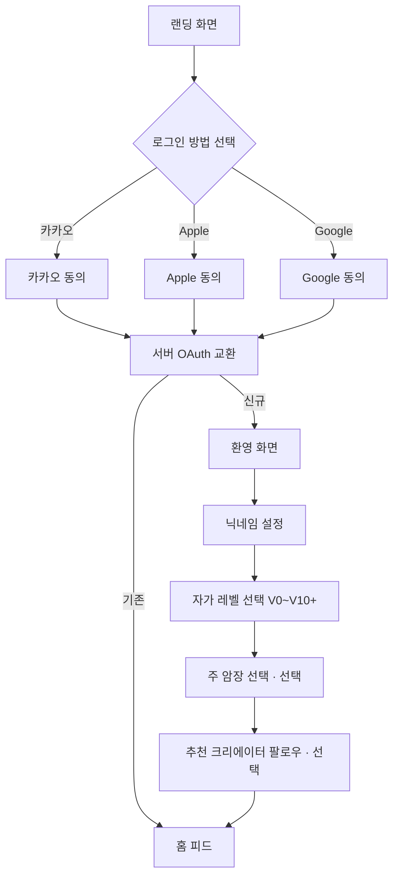

# 온보딩 플로우

소셜 로그인부터 프로필 세팅 완료까지. 최초 세션 유지율을 가르는 구간이므로 **3분 이내** 완료를 목표.

## 다이어그램

## 스크린 목록

1. **Landing** — 브랜드 문구 + 로그인 CTA 3종
2. **Provider 동의** — 각 provider 표준 화면 (Crimp 측 커스터마이징 없음)
3. **Welcome** — "환영합니다. 크림프가 당신의 클라이밍 여정을 기록할게요."
4. **Nickname** — 유효성 검사 (2-30자, 중복 체크 디바운스 400ms)
5. **Level** — V0~V10+ 칩 선택. "나중에 바꿀 수 있어요"
6. **MainGym** — 위치 권한 → 근처 5곳 + 검색. 스킵 가능
7. **Follow** — 큐레이션 10명 추천, 최소 0명 / 최대 전체
8. **Home** — 온보딩 끝, 피드 상단에 "첫 세션을 기록해 보세요" 배너

## 엣지 케이스

| 상황 | 처리 |
| --- | --- |
| Provider 동의 취소 | Landing으로 복귀, 토스트 "로그인을 완료하지 못했어요" |
| 닉네임 서버 중복 | inline 에러, 제안 닉네임 2개 |
| 위치 권한 거절 | 검색만 제공, "나중에 설정에서 변경" 안내 |
| 네트워크 실패 | 저장 직전 단계에서는 로컬 유지, 재시도 버튼 |
| 탈퇴 복구 (30일 내) | "이전 계정을 복구할까요?" 질문 후 분기 |

## A11y 포인트

- 소셜 로그인 버튼에 provider 이름 명시 (`aria-label="카카오로 로그인"`)
- 포커스 순서: 로고 → 로그인 버튼 3개 → 약관 링크
- 닉네임 입력은 자동완성 `nickname`, 레벨은 라디오 그룹
