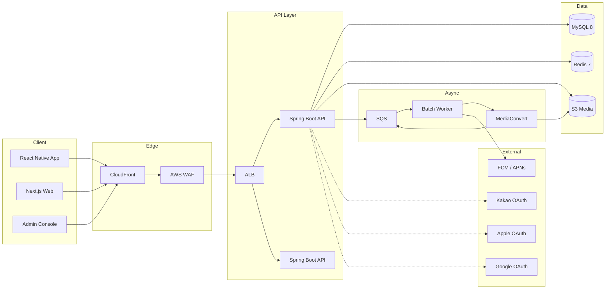

# 아키텍처 설계서

| 항목 | 내용 |
| --- | --- |
| 작성일 | 2026-04-17 |
| 작성자 | 강경원 |
| 상태 | Draft (GATE 2 승인 대기) |
| 대상 범위 | Phase 1 MVP |

## 1. 설계 원칙

1. **Mobile-first**: 앱을 1차 타겟, 웹은 랜딩·관리자·보조
2. **Cost-aware**: 영상 트래픽을 가장 큰 비용 인자로 보고 CDN·트랜스코딩 설계
3. **Zero-downtime 배포**: 스키마/API 모두 호환 단계 거침
4. **Observability by default**: 모든 API는 traceId 전파, 구조화 로그
5. **Single source of truth**: API 스펙은 OpenAPI 단일 문서, DB는 Flyway 단일 경로

## 2. 논리 아키텍처



## 3. 컴포넌트 책임

| 컴포넌트 | 책임 | 주요 기술 |
| --- | --- | --- |
| React Native App | 유저 핵심 경험 (피드·로그·암장) | RN, React Query, Zustand |
| Next.js Web | 랜딩·검색 SEO, 관리자 | Next.js 14 (App Router) |
| Spring Boot API | 비즈니스 로직·인증·영속성 | Spring Boot 3.x, JPA |
| MySQL | 영속성 스토어 (OLTP) | MySQL 8.x |
| Redis | 세션·JWT 블랙리스트·레이트리밋·피드 캐시 | Redis 7 |
| S3 | 원본 영상·이미지·썸네일 | S3 + IA 계층 |
| CloudFront | 정적 자산·미디어 전송 | Signed URL |
| MediaConvert | 영상 트랜스코딩 (720p/1080p) | AWS MediaConvert |
| SQS | 미디어 처리·알림 파이프라인 | FIFO 큐 |
| Batch Worker | 통계 집계·푸시 발송·미디어 콜백 처리 | Spring Boot (별도 프로세스) |

## 4. 배포 아키텍처

- **환경**: dev(도커 컴포즈) / stg(AWS) / prod(AWS)
- **컨테이너**: ECS Fargate, 태스크 당 API 인스턴스 2+
- **DB**: RDS MySQL 8 (Multi-AZ, prod), 단일 AZ dev/stg
- **캐시**: ElastiCache Redis (prod), 도커 Redis (dev/stg)
- **DNS**: Route53 → CloudFront → ALB
- **시크릿**: AWS Secrets Manager + Parameter Store
- **로깅**: CloudWatch → Loki (중장기)
- **메트릭**: Prometheus + Grafana
- **트레이싱**: OpenTelemetry → Tempo (또는 Datadog APM)

## 5. 비기능 요구사항 (NFR)

| 영역 | 목표 | 비고 |
| --- | --- | --- |
| 가용성 | 월 99.5% (MVP) → 99.9% (GA) | Multi-AZ, 무중단 배포 |
| API 응답 | p95 < 300ms (피드·암장), p95 < 800ms (로그 저장) | CDN 캐시 포함 |
| 영상 업로드 | 500MB 이하, 원본 → 720p 트랜스코딩 5분 내 | Presigned URL |
| 데이터 백업 | 일 1회 전체, PITR 5분 | RDS 자동 백업 |
| 보안 | OWASP Top 10, JWT 서명키 90일 회전 | WAF + Rate Limit |
| 개인정보 | PII는 암호화 컬럼, 로그 PII 마스킹 | KMS |

## 6. 보안 설계

### 인증
- Kakao / Apple / Google OAuth2 → 서버에서 ID Token 검증 → 최초 로그인 시 유저 생성
- JWT: Access 15분 / Refresh 14일, Refresh는 Redis 저장 + 블랙리스트

### 인가
- Role: `USER`, `ADMIN`, `CREW_LEADER`
- Resource-based: 게시물·크루·로그는 작성자(또는 크루장) 권한만 수정

### 전송 보안
- 모든 엔드포인트 HTTPS (HSTS 1년)
- CloudFront ↔ ALB: ACM 인증서, TLS 1.2+

### 레이트 리밋
- 인증 실패 IP: 15분 / 10회 → 차단
- 미디어 업로드: 사용자 당 10분 / 20회
- 피드 작성: 사용자 당 1분 / 5회

### 민감정보
- 이메일·전화번호: KMS + 컬럼 암호화 (`VARBINARY(256)`)
- 영상 URL: CloudFront Signed URL 10분 만료
- DB 접근 로그: Parameter Group `general_log=OFF`, `audit_log`만 prod

## 7. 데이터 플로우 (주요)

### 7.1 영상 업로드
```
클라이언트 → API (업로드 URL 요청)
API → S3 presigned PUT URL 발급
클라이언트 → S3 (업로드)
S3 → SQS (put 이벤트)
Worker → MediaConvert 작업 생성
MediaConvert → S3 (720p, 썸네일 생성)
MediaConvert → SQS (완료 이벤트)
Worker → API (media 상태 업데이트)
```

### 7.2 피드 조회 (홈)
```
App → API (GET /feed)
API → Redis (캐시 조회: user:{id}:home:{cursor})
  hit → 응답
  miss → MySQL 조회 → Redis 저장 (TTL 60s) → 응답
```

### 7.3 소셜 로그인
- 상세는 `sequence/auth.md` 참조

## 8. 확장성·병목 예상

| 대상 | 병목 예상 | 완화 전략 |
| --- | --- | --- |
| 피드 읽기 | 인기 사용자 팬아웃 | 홈 피드 캐시 60s, Read replica (Phase 2) |
| 영상 조회 | CDN 미스 | MediaConvert HLS + CloudFront |
| 좋아요·댓글 | 핫 게시물 경합 | Redis 카운터 + 주기적 flush |
| 검색 | LIKE 쿼리 | Phase 2에 OpenSearch 도입 |
| 푸시 발송 | 대량 팬아웃 | SQS + 워커 파티셔닝 |

## 9. 관찰성

### 로그
- 구조화(JSON): `{timestamp, level, traceId, spanId, userId, event, ...}`
- 요청 단위로 MDC에 traceId 삽입

### 메트릭
- RED (Rate·Error·Duration) + USE (Utilization·Saturation·Errors)
- 비즈니스: DAU, 로그 생성 수, 피드 생성 수, 영상 업로드 성공률

### 대시보드
- `grafana/dashboards/`에 JSON 소스 커밋
- 온콜 전용 뷰: p95 latency, 5xx rate, DB connection, queue depth

## 10. 오픈 이슈

- [ ] 홈 피드 랭킹 알고리즘 v1 (최신순 vs 팔로우+좋아요 가중)
- [ ] 영상 HLS 도입 시점 (MVP 포함 vs Phase 1.5)
- [ ] 관리자 콘솔 별도 배포 vs Next.js 동일 앱 내 분리 라우팅
- [ ] 결제 모듈(Phase 2)의 PG 후보 — 이니시스 / 토스페이먼츠 / 포트원
