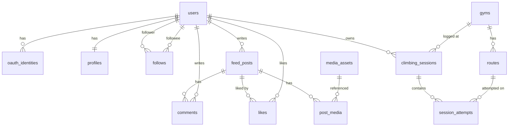

# DB 스키마 설계서

| 항목 | 내용 |
| --- | --- |
| 작성일 | 2026-04-17 |
| 작성자 | 강경원 |
| 상태 | Draft |
| DB | MySQL 8.x / utf8mb4 / utf8mb4_0900_ai_ci |
| 마이그레이션 | Flyway (`api/src/main/resources/db/migration/`) |

## 1. 공통 규약

- PK: `id BIGINT UNSIGNED AUTO_INCREMENT PRIMARY KEY`
- 외부 노출 ID: `ext_id CHAR(26)` (ULID)
- 타임스탬프: `created_at`, `updated_at` (`TIMESTAMP NOT NULL DEFAULT CURRENT_TIMESTAMP`)
- 소프트 딜리트: `deleted_at TIMESTAMP NULL DEFAULT NULL`
- 모든 테이블 `ENGINE=InnoDB DEFAULT CHARSET=utf8mb4 COLLATE=utf8mb4_0900_ai_ci`

## 2. ER 다이어그램 (MVP)



## 3. 테이블 정의

### 3.1 users
```sql
CREATE TABLE users (
  id           BIGINT UNSIGNED NOT NULL AUTO_INCREMENT,
  ext_id       CHAR(26) NOT NULL,
  email        VARBINARY(256) NULL,         -- KMS encrypted
  email_hash   CHAR(64) NULL,                -- SHA-256 for lookup
  status       TINYINT NOT NULL DEFAULT 1,   -- 1=ACTIVE, 2=SUSPENDED, 9=DELETED
  role         VARCHAR(20) NOT NULL DEFAULT 'USER',
  last_login_at TIMESTAMP NULL,
  created_at   TIMESTAMP NOT NULL DEFAULT CURRENT_TIMESTAMP,
  updated_at   TIMESTAMP NOT NULL DEFAULT CURRENT_TIMESTAMP ON UPDATE CURRENT_TIMESTAMP,
  deleted_at   TIMESTAMP NULL,
  PRIMARY KEY (id),
  UNIQUE KEY uk_users_ext_id (ext_id),
  UNIQUE KEY uk_users_email_hash (email_hash),
  KEY idx_users_status_created (status, created_at)
);
```

### 3.2 oauth_identities
```sql
CREATE TABLE oauth_identities (
  id          BIGINT UNSIGNED NOT NULL AUTO_INCREMENT,
  user_id     BIGINT UNSIGNED NOT NULL,
  provider    VARCHAR(20) NOT NULL,         -- 'KAKAO', 'APPLE'
  provider_uid VARCHAR(255) NOT NULL,
  linked_at   TIMESTAMP NOT NULL DEFAULT CURRENT_TIMESTAMP,
  PRIMARY KEY (id),
  UNIQUE KEY uk_oauth_provider_uid (provider, provider_uid),
  KEY idx_oauth_user (user_id),
  CONSTRAINT fk_oauth_user FOREIGN KEY (user_id) REFERENCES users(id)
);
```

### 3.3 profiles
```sql
CREATE TABLE profiles (
  user_id      BIGINT UNSIGNED NOT NULL,
  nickname     VARCHAR(30) NOT NULL,
  nickname_configured BOOLEAN NOT NULL DEFAULT FALSE,
  bio          VARCHAR(300) NULL,
  avatar_media_id BIGINT UNSIGNED NULL,
  level_self   TINYINT UNSIGNED NULL,       -- 자가 선언 레벨 (V0~V16)
  main_gym_id  BIGINT UNSIGNED NULL,
  updated_at   TIMESTAMP NOT NULL DEFAULT CURRENT_TIMESTAMP ON UPDATE CURRENT_TIMESTAMP,
  PRIMARY KEY (user_id),
  UNIQUE KEY uk_profiles_nickname (nickname),
  KEY idx_profiles_main_gym (main_gym_id)
);
```

### 3.4 gyms (암장)
```sql
CREATE TABLE gyms (
  id          BIGINT UNSIGNED NOT NULL AUTO_INCREMENT,
  ext_id      CHAR(26) NOT NULL,
  name        VARCHAR(100) NOT NULL,
  brand       VARCHAR(50) NULL,             -- '더클라임', '클라임웍스' 등
  address     VARCHAR(200) NOT NULL,
  lat         DECIMAL(10,7) NOT NULL,
  lng         DECIMAL(10,7) NOT NULL,
  phone       VARCHAR(20) NULL,
  opening_hours JSON NULL,
  setting_cycle_days SMALLINT NULL,          -- 세팅 주기(일)
  features    JSON NULL,                    -- {'볼더링':true,'리드':false,'문도:true}
  status      TINYINT NOT NULL DEFAULT 1,   -- 1=ACTIVE, 9=CLOSED
  created_at  TIMESTAMP NOT NULL DEFAULT CURRENT_TIMESTAMP,
  updated_at  TIMESTAMP NOT NULL DEFAULT CURRENT_TIMESTAMP ON UPDATE CURRENT_TIMESTAMP,
  PRIMARY KEY (id),
  UNIQUE KEY uk_gyms_ext_id (ext_id),
  KEY idx_gyms_geo (lat, lng),
  KEY idx_gyms_brand (brand)
);
```

### 3.5 routes (루트/문제)
```sql
CREATE TABLE routes (
  id          BIGINT UNSIGNED NOT NULL AUTO_INCREMENT,
  ext_id      CHAR(26) NOT NULL,
  gym_id      BIGINT UNSIGNED NOT NULL,
  name        VARCHAR(100) NULL,
  color       VARCHAR(20) NULL,              -- '빨강', '노랑' (암장별 표시)
  grade_scale VARCHAR(20) NOT NULL,          -- 'V', 'FONT', 'YDS'
  grade_value VARCHAR(10) NOT NULL,          -- 'V3', '6C+', '5.10a'
  grade_numeric DECIMAL(4,1) NOT NULL,       -- 비교용 정규화 그레이드
  setter      VARCHAR(50) NULL,
  set_at      DATE NULL,
  removed_at  DATE NULL,
  thumbnail_media_id BIGINT UNSIGNED NULL,
  created_at  TIMESTAMP NOT NULL DEFAULT CURRENT_TIMESTAMP,
  PRIMARY KEY (id),
  UNIQUE KEY uk_routes_ext_id (ext_id),
  KEY idx_routes_gym_active (gym_id, removed_at),
  KEY idx_routes_grade (grade_numeric),
  CONSTRAINT fk_routes_gym FOREIGN KEY (gym_id) REFERENCES gyms(id)
);
```

### 3.6 climbing_sessions
```sql
CREATE TABLE climbing_sessions (
  id           BIGINT UNSIGNED NOT NULL AUTO_INCREMENT,
  ext_id       CHAR(26) NOT NULL,
  user_id      BIGINT UNSIGNED NOT NULL,
  gym_id       BIGINT UNSIGNED NULL,        -- 외부 암장(자연 암장)일 경우 NULL
  gym_name_raw VARCHAR(100) NULL,
  started_at   TIMESTAMP NOT NULL,
  ended_at     TIMESTAMP NULL,
  duration_min SMALLINT NULL,
  note         VARCHAR(500) NULL,
  condition    TINYINT NULL,                -- 1~5 컨디션 자가평가
  created_at   TIMESTAMP NOT NULL DEFAULT CURRENT_TIMESTAMP,
  updated_at   TIMESTAMP NOT NULL DEFAULT CURRENT_TIMESTAMP ON UPDATE CURRENT_TIMESTAMP,
  deleted_at   TIMESTAMP NULL,
  PRIMARY KEY (id),
  UNIQUE KEY uk_sessions_ext_id (ext_id),
  KEY idx_sessions_user_time (user_id, started_at DESC),
  KEY idx_sessions_gym_time (gym_id, started_at DESC)
);
```

### 3.7 session_attempts
```sql
CREATE TABLE session_attempts (
  id           BIGINT UNSIGNED NOT NULL AUTO_INCREMENT,
  session_id   BIGINT UNSIGNED NOT NULL,
  route_id     BIGINT UNSIGNED NULL,
  gym_id       BIGINT UNSIGNED NULL,         -- 비정규화 (조회 최적화)
  grade_value  VARCHAR(10) NULL,             -- route 없을 때 수기 입력
  grade_numeric DECIMAL(4,1) NULL,
  result       TINYINT NOT NULL,             -- 1=SEND, 2=FLASH, 3=ONSIGHT, 4=TRY, 5=FAIL
  attempts     SMALLINT NOT NULL DEFAULT 1,
  media_id     BIGINT UNSIGNED NULL,
  note         VARCHAR(300) NULL,
  tags         JSON NULL,                    -- ['crimp','slab','overhang']
  logged_at    TIMESTAMP NOT NULL,
  PRIMARY KEY (id),
  KEY idx_attempts_session (session_id),
  KEY idx_attempts_route (route_id),
  KEY idx_attempts_gym_time (gym_id, logged_at DESC),
  CONSTRAINT fk_attempts_session FOREIGN KEY (session_id) REFERENCES climbing_sessions(id)
);
```

### 3.8 feed_posts
```sql
CREATE TABLE feed_posts (
  id           BIGINT UNSIGNED NOT NULL AUTO_INCREMENT,
  ext_id       CHAR(26) NOT NULL,
  user_id      BIGINT UNSIGNED NOT NULL,
  content      VARCHAR(2000) NULL,
  session_id   BIGINT UNSIGNED NULL,
  gym_id       BIGINT UNSIGNED NULL,
  visibility   TINYINT NOT NULL DEFAULT 1,   -- 1=PUBLIC, 2=FOLLOWERS, 3=PRIVATE
  like_count   INT UNSIGNED NOT NULL DEFAULT 0,
  comment_count INT UNSIGNED NOT NULL DEFAULT 0,
  created_at   TIMESTAMP NOT NULL DEFAULT CURRENT_TIMESTAMP,
  updated_at   TIMESTAMP NOT NULL DEFAULT CURRENT_TIMESTAMP ON UPDATE CURRENT_TIMESTAMP,
  deleted_at   TIMESTAMP NULL,
  PRIMARY KEY (id),
  UNIQUE KEY uk_posts_ext_id (ext_id),
  KEY idx_posts_user_time (user_id, created_at DESC),
  KEY idx_posts_visibility_time (visibility, created_at DESC),
  KEY idx_posts_gym_time (gym_id, created_at DESC)
);
```

### 3.9 media_assets
```sql
CREATE TABLE media_assets (
  id           BIGINT UNSIGNED NOT NULL AUTO_INCREMENT,
  ext_id       CHAR(26) NOT NULL,
  owner_user_id BIGINT UNSIGNED NOT NULL,
  kind         TINYINT NOT NULL,             -- 1=IMAGE, 2=VIDEO
  status       TINYINT NOT NULL DEFAULT 1,   -- 1=UPLOADING, 2=PROCESSING, 3=READY, 9=FAILED
  mime         VARCHAR(80) NOT NULL,
  byte_size    BIGINT UNSIGNED NULL,
  width        INT UNSIGNED NULL,
  height       INT UNSIGNED NULL,
  duration_ms  INT UNSIGNED NULL,
  s3_key       VARCHAR(500) NOT NULL,
  cdn_url      VARCHAR(500) NULL,
  thumbnail_cdn_url VARCHAR(500) NULL,
  variants     JSON NULL,                    -- [{'h':720,'url':'...'},{'h':1080,'url':'...'}]
  created_at   TIMESTAMP NOT NULL DEFAULT CURRENT_TIMESTAMP,
  PRIMARY KEY (id),
  UNIQUE KEY uk_media_ext_id (ext_id),
  KEY idx_media_owner (owner_user_id, created_at DESC),
  KEY idx_media_status (status, created_at)
);
```

### 3.10 post_media
```sql
CREATE TABLE post_media (
  post_id  BIGINT UNSIGNED NOT NULL,
  media_id BIGINT UNSIGNED NOT NULL,
  seq      SMALLINT NOT NULL,
  PRIMARY KEY (post_id, media_id),
  KEY idx_post_media_post_seq (post_id, seq),
  KEY idx_post_media_media (media_id)
);
```

### 3.11 likes
```sql
CREATE TABLE likes (
  user_id BIGINT UNSIGNED NOT NULL,
  post_id BIGINT UNSIGNED NOT NULL,
  created_at TIMESTAMP NOT NULL DEFAULT CURRENT_TIMESTAMP,
  PRIMARY KEY (user_id, post_id),
  KEY idx_likes_post_time (post_id, created_at DESC)
);
```

### 3.12 comments
```sql
CREATE TABLE comments (
  id         BIGINT UNSIGNED NOT NULL AUTO_INCREMENT,
  ext_id     CHAR(26) NOT NULL,
  post_id    BIGINT UNSIGNED NOT NULL,
  user_id    BIGINT UNSIGNED NOT NULL,
  parent_id  BIGINT UNSIGNED NULL,
  content    VARCHAR(1000) NOT NULL,
  created_at TIMESTAMP NOT NULL DEFAULT CURRENT_TIMESTAMP,
  updated_at TIMESTAMP NOT NULL DEFAULT CURRENT_TIMESTAMP ON UPDATE CURRENT_TIMESTAMP,
  deleted_at TIMESTAMP NULL,
  PRIMARY KEY (id),
  UNIQUE KEY uk_comments_ext_id (ext_id),
  KEY idx_comments_post_time (post_id, created_at),
  KEY idx_comments_parent (parent_id)
);
```

### 3.13 follows
```sql
CREATE TABLE follows (
  follower_id BIGINT UNSIGNED NOT NULL,
  followee_id BIGINT UNSIGNED NOT NULL,
  created_at  TIMESTAMP NOT NULL DEFAULT CURRENT_TIMESTAMP,
  PRIMARY KEY (follower_id, followee_id),
  KEY idx_follows_followee (followee_id, created_at DESC)
);
```

## 4. 비정규화·카운터 정책

- `feed_posts.like_count / comment_count`: Redis `post:{id}:likes` / `post:{id}:comments` 증감 → 1분 주기 DB flush
- `session_attempts.gym_id`: 쿼리 최적화를 위해 routes에서 비정규화
- 팔로워 수·팔로잉 수는 필요 시 `profile_stats` 뷰 또는 Redis 키로 캐시

## 5. 인덱스 설계 원칙

- 정렬 조건은 인덱스 뒷부분에 배치 (`(user_id, created_at DESC)`)
- 공간 검색(암장 반경)은 `(lat, lng)` 복합 인덱스 + 앱 측 바운딩박스 선계산
- JSON 컬럼 검색이 필요하면 생성 컬럼(`STORED`) + 인덱스
- 리스트 API는 커서 페이지네이션: `WHERE id < :cursor ORDER BY id DESC LIMIT 21`

## 6. 마이그레이션 순서 (초기)

| 버전 | 파일 | 내용 |
| --- | --- | --- |
| V202605010900 | `V202605010900__init_users.sql` | users, oauth_identities, profiles |
| V202605010901 | `V202605010901__init_gyms.sql` | gyms, routes |
| V202605010902 | `V202605010902__init_sessions.sql` | climbing_sessions, session_attempts |
| V202605010903 | `V202605010903__init_media.sql` | media_assets, post_media |
| V202605010904 | `V202605010904__init_feed.sql` | feed_posts, likes, comments |
| V202605010905 | `V202605010905__init_social.sql` | follows |
| V202605010907 | `V202605010907__add_attempt_ext_id.sql` | session_attempts.ext_id 추가 |
| V202605010908 | `V202605010908__feed_post_attempt_link.sql` | feed_posts ↔ attempt 연결 |
| V202605010920 | `V202605010920__seed_gyms_seoul.sql` | 수도권 검증된 암장 11곳(더클라임 9 + 클라이밍파크 신논현 + 볼더프렌즈 홍대) 1차 seed. 도로명+상세 주소는 검색 결과로 검증, 좌표는 영역 중심값(±100~300m). 더클라임 논현·사당점 및 추가 매장은 후속 검수 PR. ON DUPLICATE KEY UPDATE 로 좌표 보강 친화 |

## 7. 오픈 이슈

- [ ] `grade_numeric` 정규화 규칙 표 확정 (V-scale, Font, YDS 매핑)
- [ ] 크루 테이블 설계 (Phase 1.5)
- [ ] 알림(notifications) 테이블 포함 시점
- [ ] 게시물 신고·차단 테이블 추가 시점 (운영 이슈에 따라)
