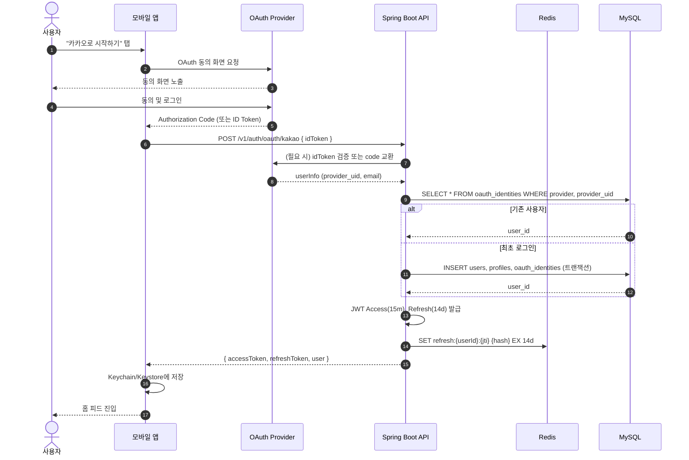
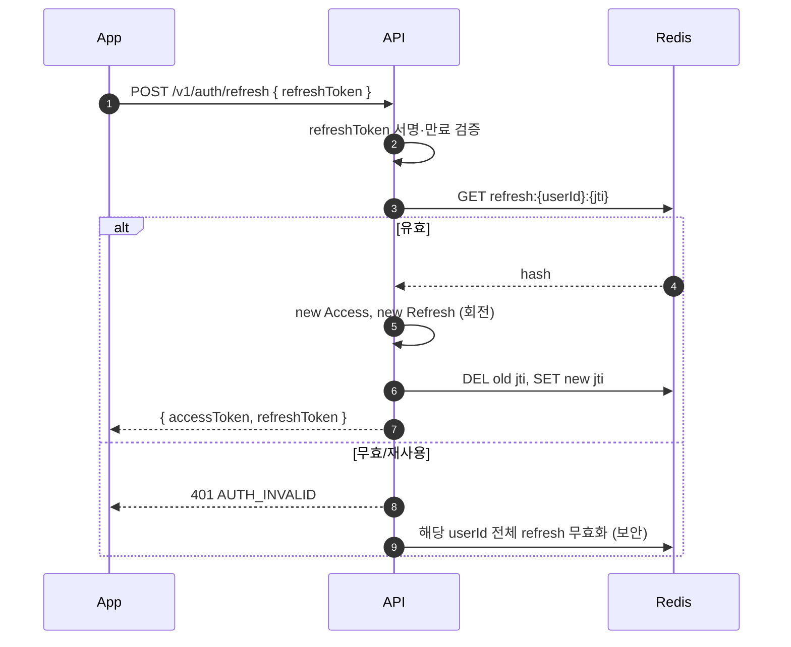
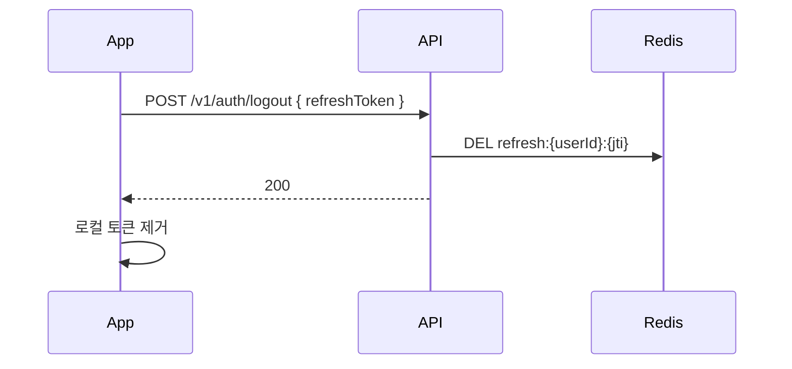

# 소셜 로그인 시퀀스

| 항목 | 내용 |
| --- | --- |
| 작성일 | 2026-04-17 |
| 상태 | Draft |
| 지원 Provider | Kakao / Apple / Google |

## 1. 정상 플로우 (최초 로그인)

## 2. 액세스 토큰 재발급

## 3. 로그아웃

## 4. 예외·엣지

| 케이스 | 처리 |
| --- | --- |
| Provider idToken 검증 실패 | 401 `AUTH_INVALID` |
| 네트워크 타임아웃 | 503 `DEPENDENCY_UNAVAILABLE` (Provider) |
| 탈퇴 상태 사용자 복구 | `users.status=9(DELETED)` 30일 이내면 복구 옵션 제시 |
| 이메일 중복(타 provider) | 동일 email_hash 있으면 연결 제안 화면 (Phase 1.5) |
| Apple 첫 로그인만 email 제공 | 최초 로그인 시 email 저장, 이후 Apple은 email 미제공 허용 |

## 5. 보안 고려

- idToken 서명 검증: JWKS 캐싱(1시간), `kid` 매핑
- `aud`는 앱 ClientID, `iss`는 provider 고정값 화이트리스트
- Refresh 회전 시 이전 토큰을 그레이스 없이 즉시 만료
- 감사 로그: 로그인 성공·실패, 이상 IP(지리적 점프) 플래그
