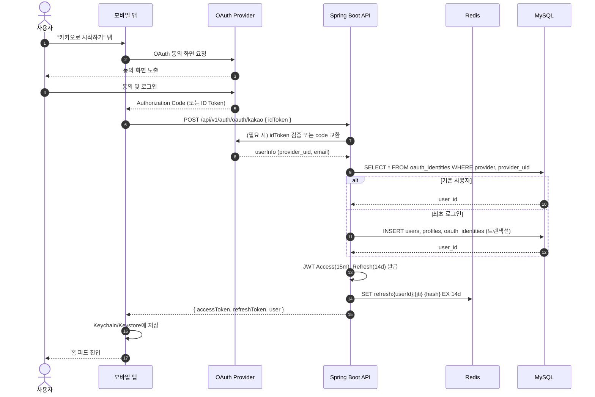
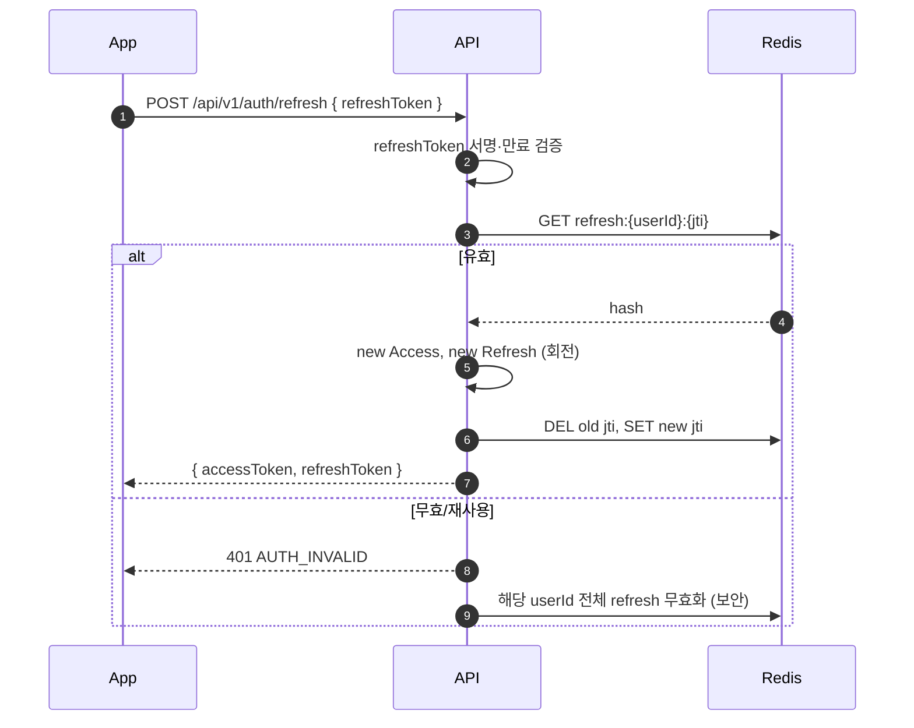
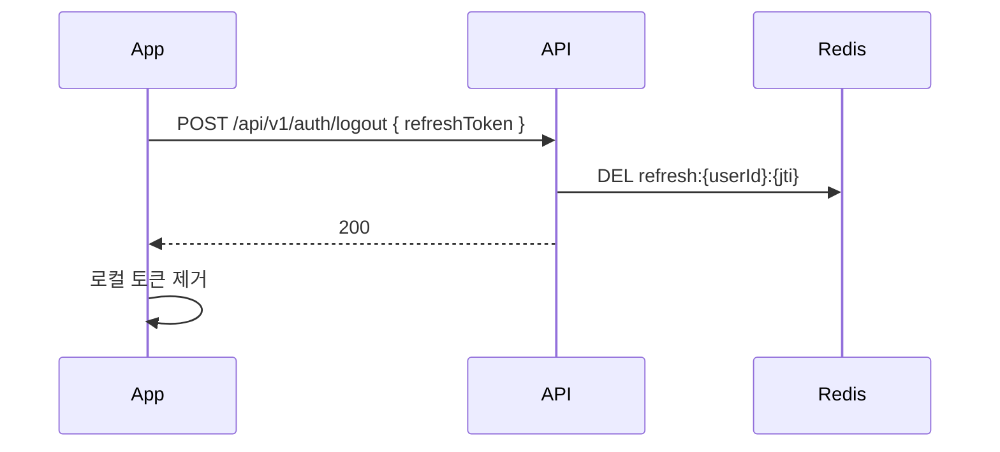
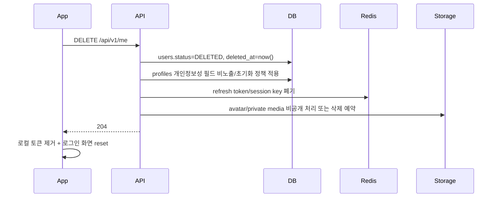

# 소셜 로그인 시퀀스

| 항목 | 내용 |
| --- | --- |
| 작성일 | 2026-04-17 |
| 상태 | Draft |
| 지원 Provider | Kakao / Apple / Google |

## 1. 정상 플로우 (최초 로그인)

## 2. 액세스 토큰 재발급

## 3. 로그아웃

## 4. 예외·엣지

| 케이스 | 처리 |
| --- | --- |
| Provider idToken 검증 실패 | 401 `AUTH_INVALID` |
| 네트워크 타임아웃 | 503 `DEPENDENCY_UNAVAILABLE` (Provider) |
| 탈퇴 상태 사용자 복구 | `users.status=9(DELETED)` 30일 이내면 복구 옵션 제시 |
| 이메일 중복(타 provider) | 동일 email_hash 있으면 연결 제안 화면 (Phase 1.5) |
| Apple 첫 로그인만 email 제공 | 최초 로그인 시 email 저장, 이후 Apple은 email 미제공 허용 |

## 4.1 계정 탈퇴 (Phase 1.5)

계정 탈퇴 후 같은 OAuth 계정으로 다시 로그인하면 기존 soft-deleted `users` 행을 부활시키지 않고 새 `users` 행을 생성한다. 기존 `oauth_identities` 행은 새 user 로 재연결한다. 탈퇴 시 `users.email/email_hash` 는 비워 같은 이메일의 재가입을 막지 않는다.

정책 기본안:
- 30일 복구 기간 동안 `oauth_identities` 는 유지하되 로그인 시 복구 분기를 노출한다.
- 복구 기간 만료 후 provider 식별자와 개인정보성 프로필 필드 삭제 또는 irreversible anonymize 를 수행한다.
- 공개 피드/댓글/시도 기록은 서비스 무결성을 위해 작성자 익명화 우선, 법적/정책상 삭제 요청 범위는 별도 약관에서 확정한다.
- `profiles.avatar_media_id` 로 연결된 프로필 이미지는 즉시 비노출하고, 보관 기간 만료 후 삭제 대상으로 예약한다.

## 5. 보안 고려

- idToken 서명 검증: JWKS 캐싱(1시간), `kid` 매핑
- `aud`는 provider별 앱 키를 명시적으로 분리해 검증한다. Kakao는
  `KAKAO_NATIVE_CLIENT_ID`(모바일 SDK), `KAKAO_WEB_CLIENT_ID`(JavaScript SDK),
  `KAKAO_REST_API_KEY`(웹 code 교환)를 각각 허용한다.
- Refresh 회전 시 이전 토큰을 그레이스 없이 즉시 만료
- 감사 로그: 로그인 성공·실패, 이상 IP(지리적 점프) 플래그
