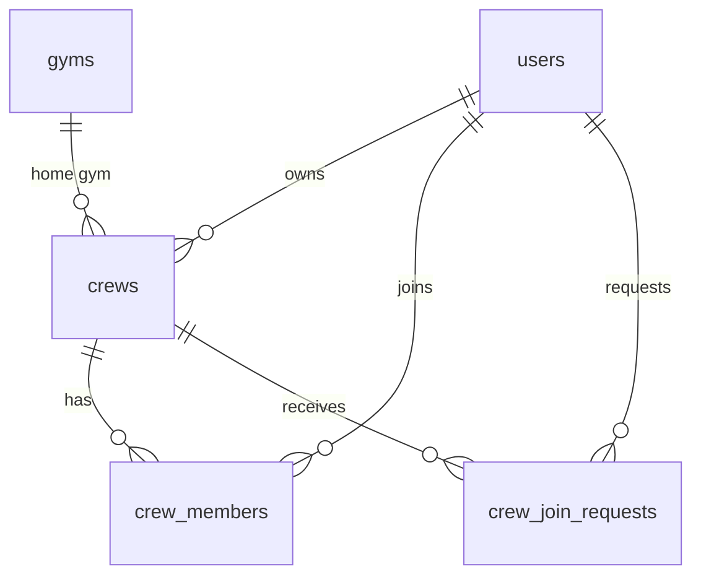
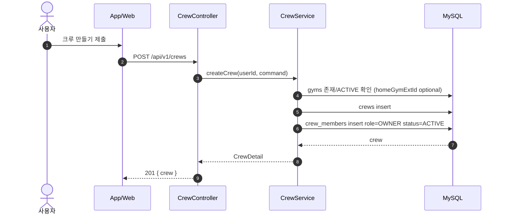
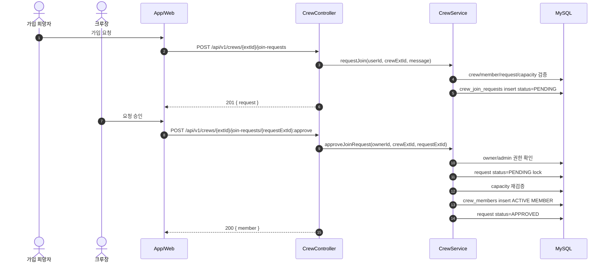

# Crew Foundation — 설계

| 항목 | 내용 |
| --- | --- |
| 작성일 | 2026-05-08 |
| 작성자 | 강경원 (kwkang@ssrinc.co.kr) |
| 상태 | Draft (GATE 2 승인 대기) |
| 상위 문서 | [../../기획/crew.md](../../기획/crew.md) |
| 영향 영역 | API · DB · App · Web |

---

## 1. 도메인 모델



### 1.1 상태 enum

| 필드 | 값 |
| --- | --- |
| `crews.visibility` | `PUBLIC`, `PRIVATE` (v0.1 생성은 PUBLIC 만) |
| `crews.join_policy` | `APPROVAL` (v0.1), `OPEN`, `INVITE_ONLY` (후속) |
| `crew_members.role` | `OWNER`, `ADMIN`, `MEMBER` |
| `crew_members.status` | `ACTIVE`, `LEFT`, `REMOVED` |
| `crew_join_requests.status` | `PENDING`, `APPROVED`, `REJECTED`, `CANCELED` |
| `crews.level_band` | `BEGINNER`, `INTERMEDIATE`, `ADVANCED`, `ALL` |
| `crews.style` | `BOULDERING`, `LEAD`, `BOTH` |

DB 는 `VARCHAR(20)` enum 문자열 저장을 기본으로 한다. 기존 숫자 enum과 섞이는 비용보다 운영 가독성이 중요하다.

---

## 2. 시퀀스 — 크루 생성



검증:
- 이름 2~30자, 소개 0~500자.
- `capacity` 는 2~200, null 이면 정원 없음.
- `homeGymExtId` 가 있으면 ACTIVE gym 만 허용.
- 같은 사용자의 크루 생성은 Phase 1.5 에서 10개까지 제한한다.

---

## 3. 시퀀스 — 가입 요청/승인



동시성:
- 승인 시 요청 row 를 `FOR UPDATE` 로 잠근다.
- 정원이 있는 크루는 승인 직전에 ACTIVE 멤버 수를 재확인한다.
- `(crew_id, user_id, status)` unique 는 MySQL partial unique 를 직접 지원하지 않으므로, v0.1 은 서비스 트랜잭션 검증 + 인덱스 조합으로 시작한다.

---

## 4. API 계약

### 4.1 목록

`GET /api/v1/crews?q=&region=&gymExtId=&levelBand=&style=&cursor=&size=`

응답:
```json
{
  "items": [
    {
      "extId": "01JCREW...",
      "name": "강남 퇴근볼더",
      "summary": "평일 저녁 강남권 V3~V6",
      "region": "서울 강남",
      "homeGym": { "extId": "01JGYM...", "name": "더클라임 강남점" },
      "levelBand": "INTERMEDIATE",
      "style": "BOULDERING",
      "memberCount": 18,
      "capacity": 30,
      "joinPolicy": "APPROVAL",
      "myStatus": "NONE"
    }
  ],
  "page": { "nextCursor": 123, "size": 20 }
}
```

`myStatus`: `NONE`, `PENDING`, `MEMBER`, `OWNER`, `ADMIN`. 비로그인 목록을 열 경우 `NONE` 으로 고정하거나 인증 필요로 막는다. v0.1 은 인증 필요.

### 4.2 상세

`GET /api/v1/crews/{extId}`

상세는 목록 필드에 `description`, `owner`, `createdAt` 을 추가한다.

### 4.3 쓰기

| Method | Path | 설명 |
| --- | --- | --- |
| POST | `/api/v1/crews` | 크루 생성 |
| PATCH | `/api/v1/crews/{extId}` | 크루 기본 정보 수정 |
| POST | `/api/v1/crews/{extId}/join-requests` | 가입 요청 |
| DELETE | `/api/v1/crews/{extId}/join-requests/me` | 내 대기 요청 취소 |
| GET | `/api/v1/crews/{extId}/join-requests` | 크루장/관리자 요청 목록 |
| POST | `/api/v1/crews/{extId}/join-requests/{requestExtId}:approve` | 가입 승인 |
| POST | `/api/v1/crews/{extId}/join-requests/{requestExtId}:reject` | 가입 거절 |
| GET | `/api/v1/crews/{extId}/members` | 멤버 목록 |
| DELETE | `/api/v1/crews/{extId}/members/me` | 크루 탈퇴 |

---

## 5. 에러 코드

| HTTP | code | 조건 |
| --- | --- | --- |
| 400 | `INVALID_CREW_REQUEST` | 필드 조합/길이 검증 실패 |
| 403 | `CREW_FORBIDDEN` | 크루장/관리자 권한 없음 |
| 404 | `CREW_NOT_FOUND` | 크루 없음 또는 비공개 접근 불가 |
| 404 | `CREW_JOIN_REQUEST_NOT_FOUND` | 가입 요청 없음 |
| 409 | `CREW_NAME_TAKEN` | 이름 중복 정책을 적용할 경우 |
| 409 | `CREW_ALREADY_MEMBER` | 이미 ACTIVE 멤버 |
| 409 | `CREW_JOIN_REQUEST_PENDING` | 이미 대기 요청 있음 |
| 409 | `CREW_CAPACITY_FULL` | 정원 초과 |
| 422 | `CREW_OWNER_LEAVE_BLOCKED` | 마지막 owner 탈퇴 시도 |

---

## 6. 클라이언트 화면

### 6.1 App

- `CrewListScreen`: 검색 input, 필터 chip, crew card list.
- `CrewDetailScreen`: 상세 정보 + 가입 CTA.
- `CrewFormScreen`: 생성/수정.
- `CrewJoinRequestsScreen`: owner/admin 전용 승인 목록.

### 6.2 Web

- `/crews`: 목록.
- `/crews/[extId]`: 상세.
- `/crews/new`: 생성.
- `/crews/[extId]/requests`: 요청 관리.

---

## 7. 구현 순서

1. DB migration + domain entity/repository.
2. API read path: 목록/상세 + `myStatus`.
3. API write path: 생성/수정 + 가입 요청/승인/거절.
4. App/Web 목록·상세.
5. App/Web 생성·요청 관리.

---

## 8. 후속 결정

- 크루 이름 전역 unique 여부. v0.1 기본안은 전역 unique 로 단순화.
- `PRIVATE`/초대 링크 도입 시점.
- 멤버 강제 추방과 owner 양도 정책.
- 알림 도메인 연결 방식.
