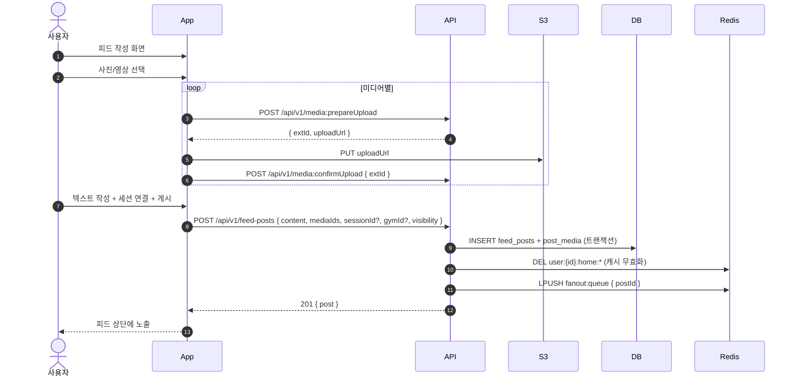
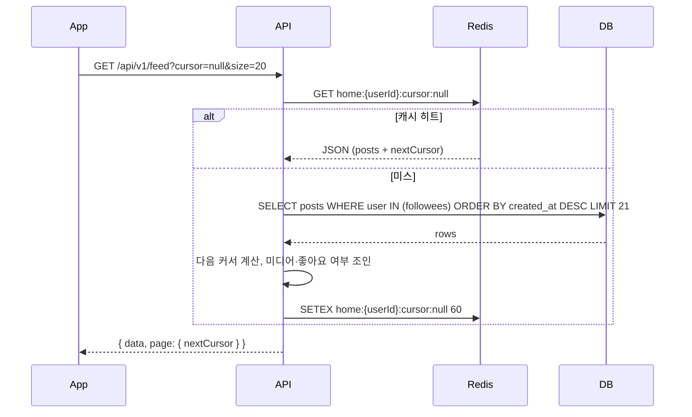
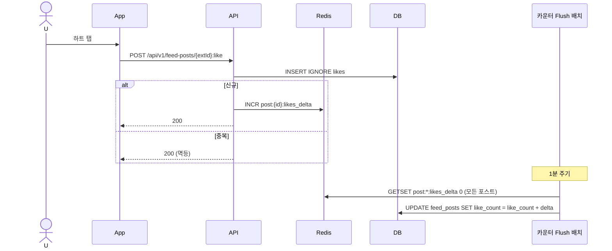
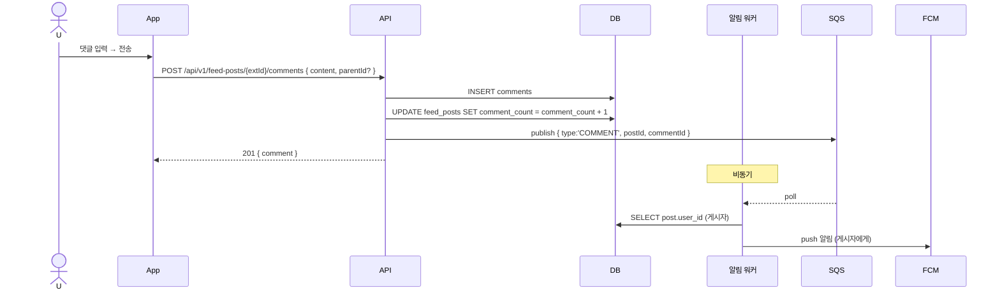

# 피드 시퀀스

| 항목 | 내용 |
| --- | --- |
| 작성일 | 2026-04-17 |
| 상태 | Draft |

## 1. 피드 작성

## 2. 홈 피드 조회 (Pull 모델 + 캐시)

- 팔로우가 많지 않은 MVP는 Pull 모델, 인기 유저 등장 시 Hybrid(Push to Home Timeline) 도입 검토

## 3. 좋아요·카운터

## 4. 댓글

## 5. 조회·상세·수정·삭제

- 상세: `GET /api/v1/feed-posts/{extId}` — 댓글 최초 20개 포함, 이후 `GET /comments`로 페이지네이션
- 수정: `PATCH /api/v1/feed-posts/{extId}` — 작성자만, 15분 내 편집, 이후는 삭제 후 재작성
- 삭제: `DELETE /api/v1/feed-posts/{extId}` — 소프트 딜리트, 피드 목록에서 제외

## 6. 예외·엣지

| 케이스 | 처리 |
| --- | --- |
| 본인이 본인 게시물에 좋아요 | 허용 (정책), like_count 증가 |
| 탈퇴 사용자 게시물 | 게시물은 유지. 작성자 `userExtId=null/누락`, 닉네임 `탈퇴사용자`, `avatarColorHue=0`, 프로필 이미지 비노출 |
| 신고된 게시물 | `visibility=HIDDEN` 임시 값 (Phase 1.5에서 신고 테이블 추가) |
| 미디어 처리 실패 | 게시물은 유지, 해당 미디어만 placeholder로 노출 |
| 팔로우 0명 | 기본 피드: 전체 공개 최신순 20개 |
