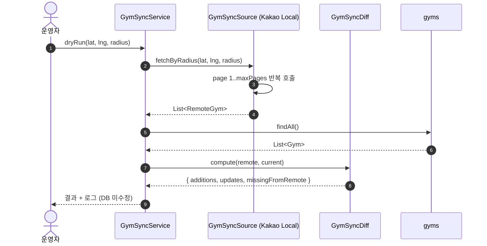
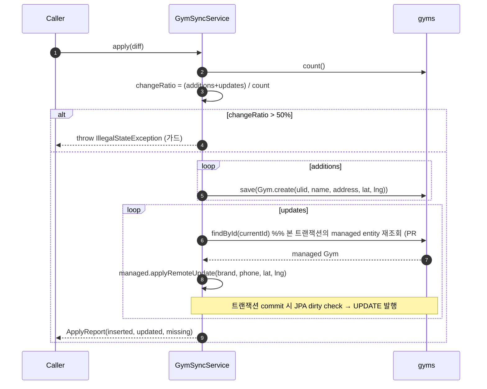

# Gym 동기화 배치 — 설계

| 항목 | 내용 |
| --- | --- |
| 작성일 | 2026-04-28 |
| 작성자 | 강경원 (kwkang@ssrinc.co.kr) |
| 상태 | Phase 1 스켈레톤 (본 PR) → Phase 1.5+ 본격 도입 |
| 영향 영역 | API (crimp-domain, crimp-infra) |

---

## 1. 목적

수도권 외 지역의 매장 누락, 신규 개업, 폐업 매장의 자동 반영을 위해 외부 위치 검색
소스(Kakao Local API 등) 를 주기적으로 호출해 DB 와 동기화한다.

본 PR(Phase 1) 은 도메인 포트·어댑터·diff 로직·Kakao Local 클라이언트 + 단위 테스트
까지를 포함한다. 실제 `@Scheduled` 활성화·admin API·폐업 마킹은 Phase 1.5 에서 도입.

## 2. 컴포넌트

```
┌────────────────────────────┐
│  GymSyncScheduler (1.5+)   │  @Scheduled 또는 admin API
└────────────┬───────────────┘
             ▼
┌────────────────────────────┐         ┌────────────────────┐
│   GymSyncService (domain)  │ ──────▶ │ GymSyncSource (port)│
│   - dryRun()               │         └────────────────────┘
│   - apply(Result)          │                  ▲
│   - threshold guard 50%    │                  │
└────────────┬───────────────┘         ┌────────┴────────────┐
             │                         │ KakaoLocalGymClient │
             ▼                         │ (infra adapter)     │
┌────────────────────────────┐         └─────────────────────┘
│  GymSyncDiff (pure)        │                  │
│  - matchKey(name+addr)     │                  ▼
│  - threshold logic         │         Kakao Local API
└────────────────────────────┘
```

## 3. 시퀀스 — dry-run



## 4. 시퀀스 — apply (가드 통과 시)



## 5. 매칭·diff 정책

- **매칭 키**: `(이름, 주소)` 의 정규화된 페어. 공백·대소문자·NBSP·전각공백 차이는 동일 매장.
- **좌표 변경 임계치**: 위도/경도 절대 차이 0.0005 (≒ 50m). 그 이상이면 update 후보.
- **brand/phone 차이**: 단순 문자열 비교. 차이 있으면 update 후보. 단, 외부 응답이 null 이면 "정보 누락" 으로 보고 update 후보에서 제외 (기존 값 보존, PR #85 I3).
- **폐업 마킹**: 단일 호출로는 결정 불가. 다중 좌표 호출 결과를 합친 후 "어느 호출에서도 안
  보임" 인 row 만 후보. **본 PR 에서는 적용 안 함** (Phase 1.5).
- **운영 안전장치 (apply)**: `additions + updates` 가 전체의 50% 초과면 차단.

## 6. Kakao Local API 사용

- 엔드포인트: `GET https://dapi.kakao.com/v2/local/search/keyword.json`
- 헤더: `Authorization: KakaoAK <REST_API_KEY>`
- 파라미터: `query=클라이밍, x=lng, y=lat, radius=5000, size=15, page=1..3`
- 응답: `documents[]` (id, place_name, address_name, road_address_name, x, y, phone) + `meta.is_end`
- 설정: `app.gym-sync.kakao-local.*` (application.yml)
- API 키: `KAKAO_REST_API_KEY` env (OAuth 흐름과 동일 키 재사용)

## 7. 알려진 한계 / 후속

| 항목 | 상태 |
| --- | --- |
| `@Scheduled` 트리거 | 본 PR 미포함. `@EnableScheduling` 도 미설정 |
| admin API (`POST /api/v1/admin/gyms/sync`) | 미구현. 인증·권한 가드 필요해 별도 설계 |
| `Gym` 엔티티의 update 메서드 | 구현 완료. `Gym.applyRemoteUpdate(brand, phone, lat, lng)` 로 좌표·brand·phone 만 갱신 (이름/주소는 매칭 키로 보존) |
| 폐업 마킹 (status=CLOSED) | 미구현. 다중 좌표 호출 통합 단계 필요 |
| Slack/Discord webhook | 미구현 |
| `gym_sync_log` 감사 테이블 | 미구현. 현재는 application 로그만 |
| 다중 소스 (Naver Place 등) | 미구현 |
| 좌표 격자 자동 스캔 (전국) | 미구현. 현재는 호출자가 좌표·반경 명시 |
| Brand 추정 정확도 | 단순 prefix 추정 — `BrandNormalizer` 의 synonym 사전이 보강 |
| 좌표 정확도 검수 (PR #82 후속) | 본 어댑터를 활용해 시드 13곳 좌표 갱신 가능 |

## 8. 변경 이력

| 일자 | 변경 |
| --- | --- |
| 2026-04-28 | 최초 작성 — 도메인 포트·diff·Kakao Local 어댑터 스켈레톤 |
