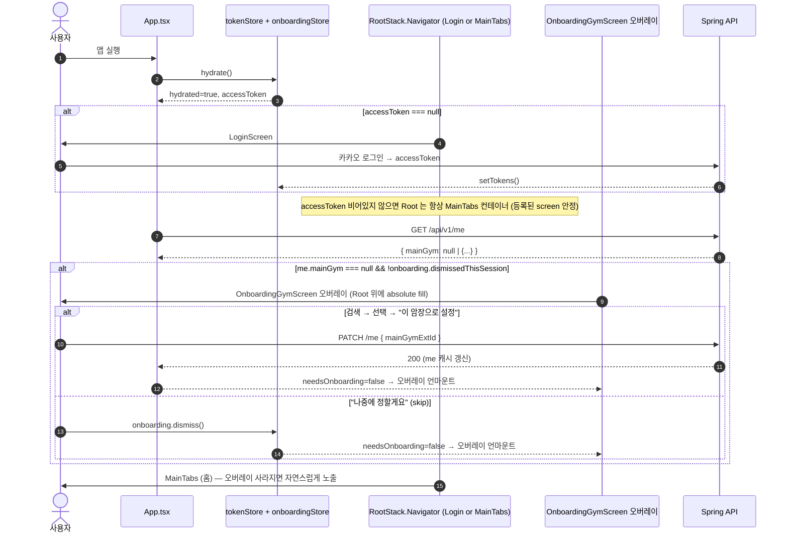
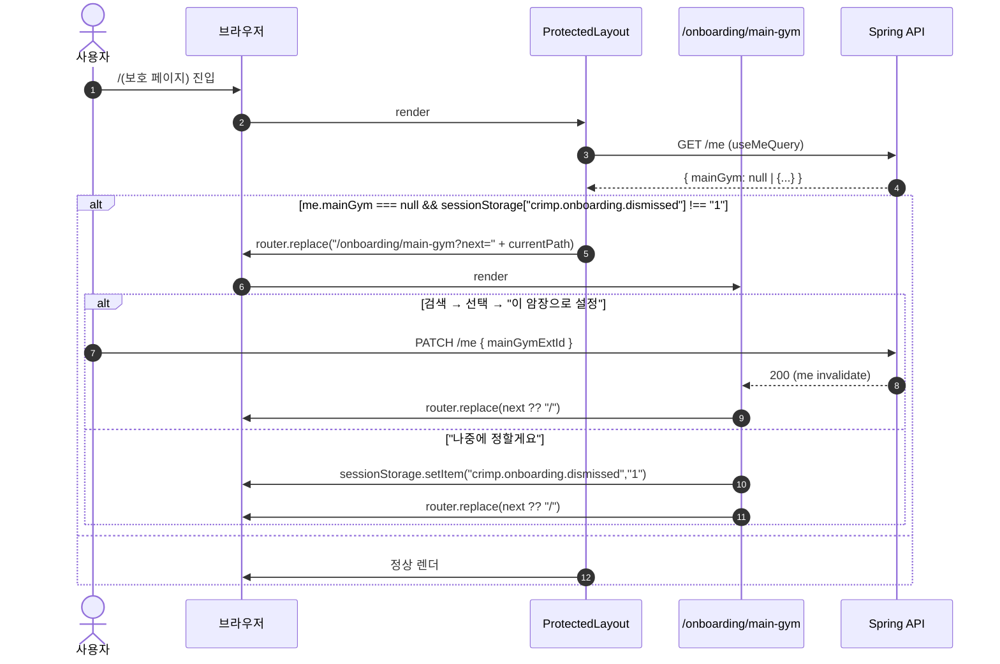

# MainGym Onboarding Gate — 설계

| 항목 | 내용 |
| --- | --- |
| 작성일 | 2026-04-28 |
| 작성자 | 강경원 (kwkang@ssrinc.co.kr) |
| 상태 | Draft (GATE 2 승인 대기) |
| 상위 문서 | [../../기획/maingym-onboarding.md](../../기획/maingym-onboarding.md) |
| 영향 영역 | App (RN) · Web (Next.js) — **백엔드 변경 없음** |

---

## 1. 시퀀스 — App (React Native)



### 1.1 hardware back

OnboardingGymScreen 에서 안드로이드 hardware back 버튼:

```
back 누름 → Alert (exitConfirmTitle / exitConfirmBody / [취소, 종료])
종료 → BackHandler 의 default 동작 (앱 종료)
취소 → 게이트 유지
```

iOS swipe back / 헤더 chevron 없음 (gestureEnabled=false, headerLeft=null).

### 1.2 로그아웃 시 초기화

`useTokenStore.clear()` 시 `onboardingStore.reset()` 도 같이 호출 — 다음 로그인의 다른 계정 진입을 깨끗하게 만들기 위함. 코드상 `useLogout` 훅 안에서 1줄 추가.

## 2. 시퀀스 — Web (Next.js App Router)



### 2.1 새 탭 / 새 세션

`sessionStorage` 는 탭 단위 — 새 탭이나 브라우저 재시작 후 첫 진입에서는 dismiss 가 비어있으므로 게이트가 다시 뜬다. 이는 기획서 §5.1 의 "재노출" 정책과 부합.

### 2.2 `/onboarding/main-gym` 자체의 가드 우회

해당 페이지 자체는 ProtectedLayout 의 redirect 대상이므로 redirect 무한 루프를 막기 위해 layout 가드 조건에서 `pathname !== "/onboarding/main-gym"` 을 추가로 검사. 또한 `me.mainGym !== null` 인데 페이지에 진입했으면 (URL 직타) 즉시 `next` 또는 `/` 로 replace.

## 3. App — 컴포넌트 인터페이스

### 3.1 신규: `src/store/onboardingStore.ts`

```ts
import { create } from 'zustand';

interface OnboardingState {
  /** 현 앱 실행 한정 — mainGym 게이트를 사용자가 명시적으로 미루겠다 표시한 상태. */
  dismissedThisSession: boolean;
  dismiss: () => void;
  reset: () => void;
}

export const useOnboardingStore = create<OnboardingState>((set) => ({
  dismissedThisSession: false,
  dismiss: () => set({ dismissedThisSession: true }),
  reset: () => set({ dismissedThisSession: false }),
}));
```

persist 안 함 (앱 종료 시 자연 휘발).

### 3.2 신규: `src/screens/OnboardingGymScreen.tsx`

```ts
type Props = NativeStackScreenProps<RootStackParamList, 'OnboardingGym'>;

export default function OnboardingGymScreen({ navigation }: Props): JSX.Element;
```

내부 구조 (재사용 우선):
- 검색 입력 + 결과 리스트 — `useGymsQuery({ q })` 재사용 (이미 ProfileScreen `MainGymPickerModal` 에 같은 쿼리 사용)
- 선택 상태는 로컬 useState
- "이 암장으로 설정" → `useUpdateProfile().mutate({ mainGymExtId })`
  - onSuccess: navigation 자동 전환 (RootNavigator 가 me.mainGym 채워짐 감지)
  - onError: inline 에러 표시, 게이트 유지
- "나중에 정할게요" → `useOnboardingStore.getState().dismiss()`
- BackHandler — Android hardware back 처리

### 3.3 수정: `src/navigation/types.ts`

```ts
export type RootStackParamList = {
  Login: undefined;
  Home: undefined;
  OnboardingGym: undefined;   // 신규
  DesignPrimitives: undefined;
  // ... 기존 화면들
};
```

### 3.4 수정: `App.tsx` — 오버레이 패턴

RootStack 의 screen 등록 집합은 `accessToken` 변화에만 좌우된다 (LoginStack ↔
인증 후 컨테이너). OnboardingGymScreen 은 별도 screen 으로 등록하지 않고,
인증된 RootStack 위에 absolute position 으로 덮는다.

```tsx
const me = useMeQuery(accessToken);
const dismissed = useOnboardingStore((s) => s.dismissedThisSession);
const needsOnboarding =
  accessToken !== null &&
  me.data !== undefined &&
  me.data.mainGym == null &&
  !dismissed;

<View style={{ flex: 1 }}>
  <RootStack.Navigator>
    {accessToken === null ? (
      <>
        <RootStack.Screen name="Login" component={LoginScreen} ... />
        <RootStack.Screen name="DesignPrimitives" component={DesignPrimitivesScreen} ... />
      </>
    ) : (
      <>
        <RootStack.Screen name="Home" component={MainTabs} options={{ headerShown: false }} />
        <RootStack.Screen name="DesignPrimitives" component={DesignPrimitivesScreen} ... />
      </>
    )}
  </RootStack.Navigator>

  {needsOnboarding ? (
    <View style={StyleSheet.absoluteFillObject} accessibilityViewIsModal>
      <OnboardingGymScreen />
    </View>
  ) : null}
</View>
```

**왜 분기 대신 오버레이인가:** 분기 방식(needsOnboarding 일 때 RootStack 에 OnboardingGym 만 등록)은 LoginScreen 의 `navigation.reset({Home})` 이나 HomeScreen 의 `navigation.navigate('SessionList')` 같은 기존 호출이 게이트가 떠 있는 동안 등록된 screen 을 못 찾아 *"action not handled by any navigator"* 런타임 에러를 낸다. 오버레이는 RootStack 자체를 안정 상태로 두면서 시각적·인터랙션적으로만 게이트를 덮는다.

`OnboardingGymScreen` 은 native-stack 의 screen props 를 받지 않는 일반 컴포넌트로 작성되어 있어, screen 으로 등록되든 오버레이로 쓰이든 그대로 동작한다.

### 3.5 수정: `useLogout` (또는 store.clear 호출부)

```ts
useTokenStore.getState().clear();
useOnboardingStore.getState().reset();   // 신규 1줄
queryClient.clear();
```

## 4. Web — 컴포넌트 인터페이스

### 4.1 신규: `web/src/lib/auth/onboardingDismiss.ts`

```ts
const KEY = 'crimp.onboarding.dismissed';

export const onboardingDismiss = {
  isDismissed(): boolean {
    if (typeof window === 'undefined') return false;
    return window.sessionStorage.getItem(KEY) === '1';
  },
  set(): void {
    if (typeof window === 'undefined') return;
    window.sessionStorage.setItem(KEY, '1');
  },
  clear(): void {
    if (typeof window === 'undefined') return;
    window.sessionStorage.removeItem(KEY);
  },
};
```

`kakaoOauthState.ts` 와 같은 모듈 격리 패턴.

### 4.2 신규: `web/app/onboarding/main-gym/page.tsx`

`/onboarding/main-gym` 라우트:
- 인증 게이트 (accessToken 없으면 `/login` 으로 replace — 기존 ProtectedLayout 같은 패턴)
- 이미 mainGym 있으면 `next` 또는 `/` 로 즉시 replace
- 검색 + 선택 + "이 암장으로 설정" / "나중에 정할게요"
- 스타일은 기존 `MainGymPickerDialog` 의 검색 UI 재사용 (컴포넌트 추출 후 공유 — `web/src/components/me/GymSearchPanel.tsx` 정도로)

### 4.3 신규/수정: `web/app/(protected)/layout.tsx` 또는 기존 가드 진입점

기존 보호 페이지 가드 위치 확인 후 (현재 `app/page.tsx` 등에서 인라인 처리) 다음 분기 추가:

```tsx
const me = useMeQuery();
const pathname = usePathname();
useEffect(() => {
  if (!me.data) return;
  if (pathname === '/onboarding/main-gym' || pathname === '/login') return;
  if (me.data.mainGym == null && !onboardingDismiss.isDismissed()) {
    router.replace(`/onboarding/main-gym?next=${encodeURIComponent(pathname)}`);
  }
}, [me.data, pathname, router]);
```

> 구현 단계에서 현재 web 가드의 단일화 위치 확인 후 정확한 파일 결정. 분산되어 있으면 이 PR 에서 단일 wrapper 로 정리.

### 4.4 로그아웃 시 초기화

`useLogout` (또는 동등 위치) 에서 `onboardingDismiss.clear()` 1줄 추가.

## 5. 캐시 무효화 — 미결사항 검증 결과 반영

### 5.1 검증 (구현 단계 진입 시 1회 확인)
- `app/src/hooks/useUpdateProfile.ts` 와 `web/src/hooks/useUpdateProfile.ts` 가 mutation onSuccess 에서 `feed` 쿼리 invalidate 중인지 확인.
- 누락되어 있으면 본 PR 에서 함께 처리. (기획서 §7 Open Questions 의 검증 항목)

### 5.2 me 쿼리

- mainGym set 직후 `queryClient.invalidateQueries({ queryKey: ['me'] })` — 기존 `useUpdateProfile` 이 처리 중인지 확인. 처리 안 하면 RootNavigator 의 분기가 갱신되지 않아 게이트가 유지됨.

## 6. 테스트 전략

### 6.1 App 단위 테스트
- `OnboardingGymScreen` 렌더 (loading / 결과 0건 / 결과 N건 / mutation 에러)
- `RootNavigator` 분기 — me.mainGym null + dismissed=false → OnboardingGym, dismissed=true → Home, mainGym 있음 → Home
- onboardingStore — dismiss / reset 토글

### 6.2 Web 단위 테스트
- `/onboarding/main-gym` 페이지 렌더 (가드 통과·미통과)
- ProtectedLayout 가드 — me.mainGym null + sessionStorage 비어있음 → redirect, dismissed=1 → 통과
- `onboardingDismiss` 모듈 — SSR 안전성

### 6.3 통합 / E2E
- 신규 카카오 로그인 → 게이트 표시 → set → 홈
- 신규 카카오 로그인 → 게이트 표시 → skip → 홈
- skip 후 재로그인 → 게이트 재노출 (재노출 정책 회귀 테스트)

## 7. 영향 파일 목록 (예상)

### App
```
NEW  app/src/store/onboardingStore.ts
NEW  app/src/screens/OnboardingGymScreen.tsx
MOD  app/App.tsx
MOD  app/src/navigation/types.ts
MOD  app/src/hooks/useLogout.ts (또는 store.clear 호출부)
MOD  app/src/i18n/ko.json, en.json
NEW  app/src/screens/__tests__/OnboardingGymScreen.test.tsx (해당 패턴이 이미 있다면)
NEW  app/src/store/__tests__/onboardingStore.test.ts
```

### Web
```
NEW  web/src/lib/auth/onboardingDismiss.ts
NEW  web/app/onboarding/main-gym/page.tsx
MOD  web/app/layout.tsx (또는 보호 wrapper) — 가드 추가
MOD  web/src/hooks/useLogout.ts (clear 호출부)
MOD  web/src/lib/i18n/ko.json, en.json
NEW  web/src/lib/auth/__tests__/onboardingDismiss.test.ts
```

검증 후 변경 — `useUpdateProfile.ts` 양쪽 (캐시 invalidate 누락 시).

## 8. 단일 PR vs. 분리

App 변경과 Web 변경은 **독립** — 별도 PR 권장.
- PR A: App OnboardingGate (`feature/app-maingym-onboarding`)
- PR B: Web OnboardingGate (`feature/web-maingym-onboarding`)

i18n 키는 양쪽에 동시 추가하므로 먼저 머지되는 쪽에서 추가, 나머지는 sync.

## 변경 이력

| 일자 | 변경 |
| --- | --- |
| 2026-04-28 | 최초 작성 (Draft) |
