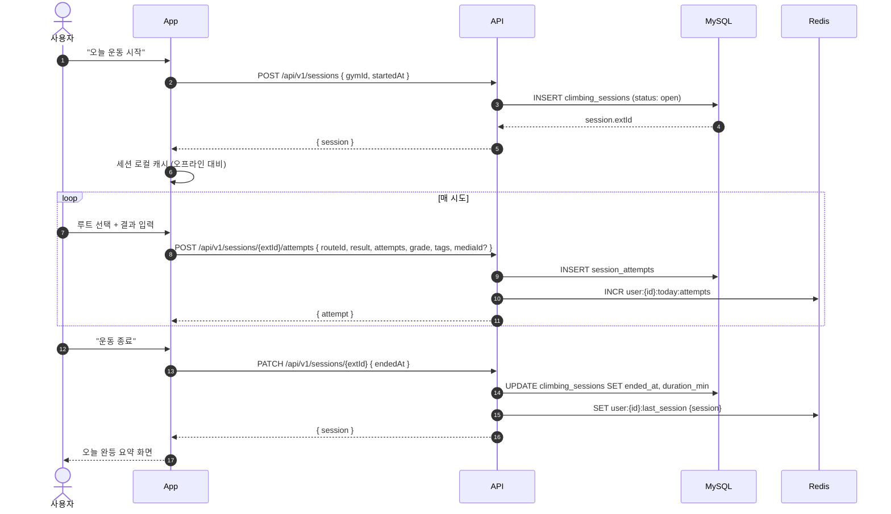
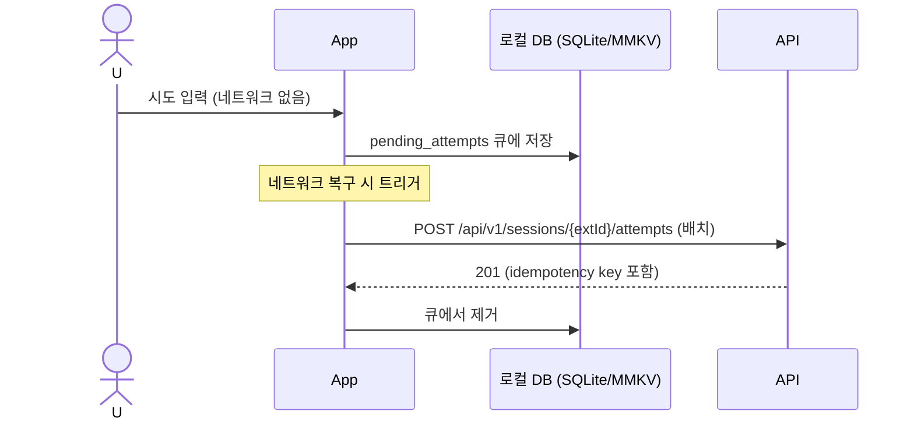
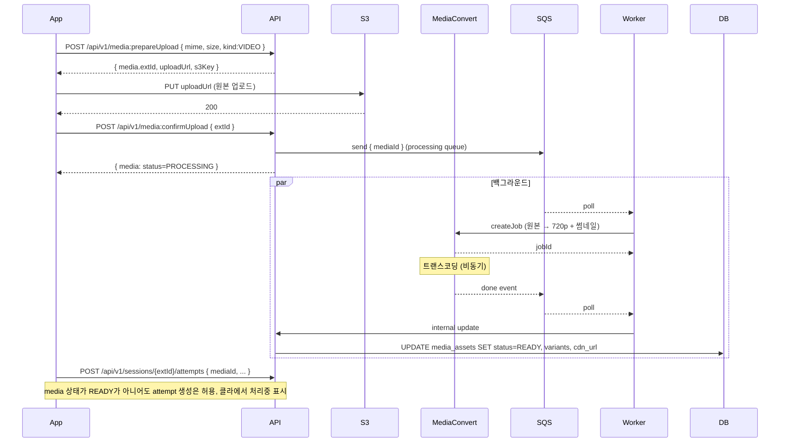
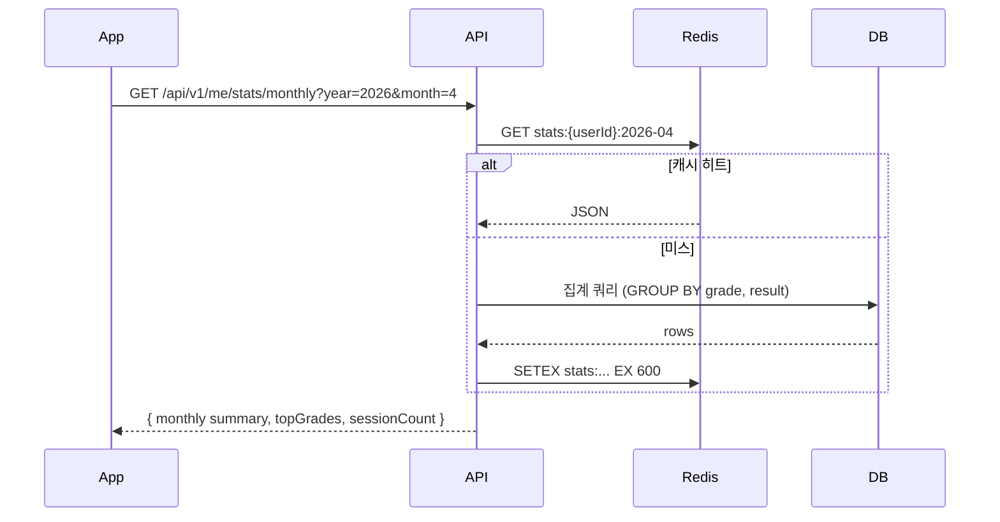

# 등반 세션 로그 시퀀스

| 항목 | 내용 |
| --- | --- |
| 작성일 | 2026-04-17 |
| 상태 | Draft |

## 1. 세션 시작 → 시도 추가 → 종료

## 2. 오프라인 로깅 (앱 로컬 저장)

- 앱은 각 attempt에 UUID 생성 → `Idempotency-Key` 헤더로 전송 → 서버 측 중복 방지

## 3. 영상 첨부 흐름 (attempt에 영상 붙이기)

## 4. 월별 통계 조회

## 5. 예외·엣지

| 케이스 | 처리 |
| --- | --- |
| 세션이 종료되지 않은 채 24h 초과 | 배치가 자동 종료 (ended_at=last_attempt + 30m) |
| 삭제된 루트에 attempt 추가 | 허용하되 route_id NULL, grade 수기 입력 |
| 외부 암장(자연암장) 기록 | gym_id NULL, gym_name_raw 사용 |
| 시도 수정 권한 | 본인만 (작성 후 7일 내), 이후 admin 경유 |
| 영상 업로드 실패 | presigned URL 만료 10분, 재요청 필요 |
